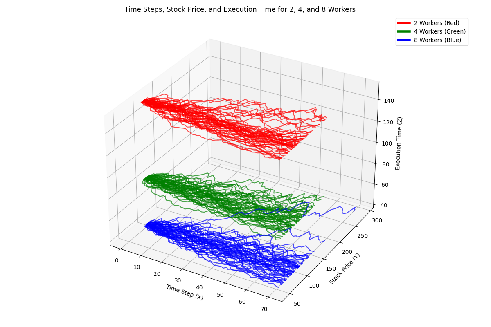

# Distributed Computing of the Monte Carlo Simulation on Options Pricing

The [Monte Carlo Simulation](https://en.wikipedia.org/wiki/Monte_Carlo_method) is a stochastic method that relies on random sampling to solve problems that might be deterministic in nature. Here we use the Monte Carlo Method to price options of a financial instrument by simulating various future paths and averaging the discounted payoff. This is useful when pricing complex derivatives where close-formed solutions are not available.

The goal of this research is to distribute $\approx$ 10,000 Monte Carlo simulations across 10 virtual machines where each machine handles 1,000 simulations each to speed up computation time.

We define variables:

$$
let \begin{cases}
r &= \text{Risk-free interest} \\
S_{0} &= \text{Current stock price} \\
Z &\sim \mathcal{N}(0, 1) \\
\Delta t &= \text{Time increment} \\
\sigma &= \text{Volatility} \\
K &= \text{Strike price} \\
T &= \text{Expiration date}\\
\end{cases}
$$

## Geometric Brownian Motion

First, we introduce the notion for the [Geometric Brownian Motion](https://en.wikipedia.org/wiki/Geometric_Brownian_motion) widely used for modeling the assets price path over the simulation. We start the simulation at the stocks current price point, and observe how it changes as the number of steps increases. We sample a random gaussian variable $Z$ from $\mathcal{N}(0,1)$. $\\$\
$S_{t}+\Delta t = S_{t-1} \cdot \exp\left( (r - \frac{\sigma^{2}}{2}) \cdot \Delta t + \sigma \cdot \sqrt{\Delta t} \cdot Z \right)$ $\\\\$

where $\Delta t$ = $\frac{\text{time to expiration}}{\text{Steps}}$\
We are interested in observing the payoff of the stock over the time interval as the assets price changes over the number of steps.

## Black Scholes Model

We then introduce the [Black Scholes Model](https://en.wikipedia.org/wiki/Black%E2%80%93Scholes_model) widely used for pricing stocks based on their volatility and time with respect to calculating the theoretical options price.

$$ cost\_{call} = S_0 \cdot N(d_1) - K \cdot e^{-rT} \cdot N(d_2) $$

$$ cost\_{put} = K \cdot e^{-rT} \cdot N(-d_2) - S_0 \cdot N(-d_1) $$

Where \( N \) is the Gaussian CDF, and cost represents the theoretical option price.

So, let us define:

$$ d_1 = \frac{\ln\left(\frac{S_0}{K}\right) + \left( r + \frac{\sigma^2}{2} \right)T}{\sigma \sqrt{T}} $$

$$ d_2 = d_1 - \sigma\sqrt{T} $$
Where $d_2$ is the expectation of $\sigma$ and $d_1$ is the number of standard deviations where the current $S_t$ > $K$ from the expected growth of the asset.

# Cost Function

We then calculate the error to view how accurate our simulation was. We take the absolute difference between the GBM price and the Black Scholes price to approximate the theoretical value. Ideally, we are looking for the error to be small, meaning our simulation is producing results close to the expected theoretical price. The error indicates to us whether the GBM converges to the Black Scholes model as we increase the number of simulations.

$$ error = | \text{GBM Simulated Price} - \text{Black Scholes Price} | $$

# Distributed Computing Architecture

We hosted 10 VM's in [digital oceans](https://www.digitalocean.com/?utm_campaign=&utm_adgroup=&_keyword=digital%20ocean&_device=c&_adposition=&utm_content=&utm_medium=&utm_source=google&gad_source=1&gclid=CjwKCAjwx4O4BhAnEiwA42SbVGPd3FV9jRBghMXYhcsiOsN7E9DckmcgPRoOFcq0reL170Vf2X3faBoCasMQAvD_BwE) ecosystem, where 1 is the Master Node, 8 are worker nodes, and 1 is the scheduler. We then distributed 10,000 simulations across the 8 worker nodes and found that as our simulation converged.

## Graph to show comparision of 1 worker to multiple worker nodes

# Misc

The math behind this project is bundled into a package on [Pypi](https://pypi.org/manage/project/mc-option-simulator-yale/releases/) and installation instructions can be found [here](https://github.com/yalehacks/MonteMath/blob/main/MonteCarloPricing/readme.MD)
